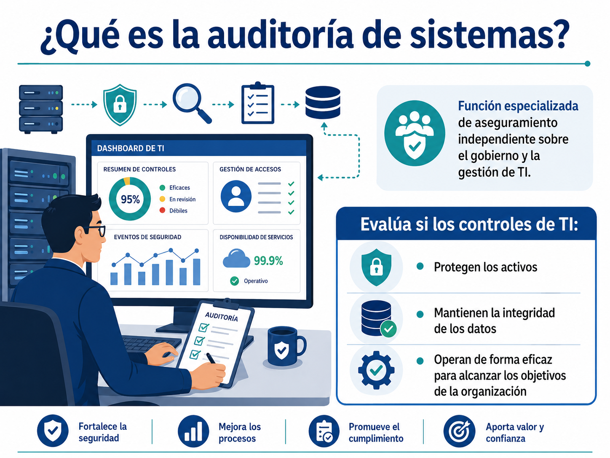
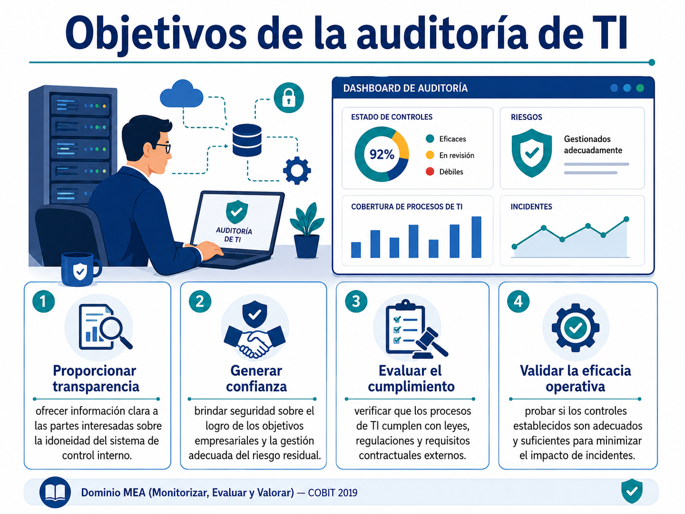
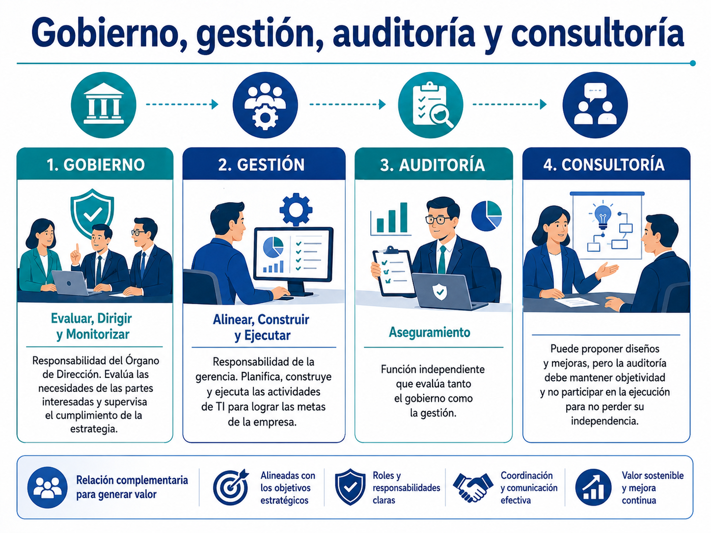
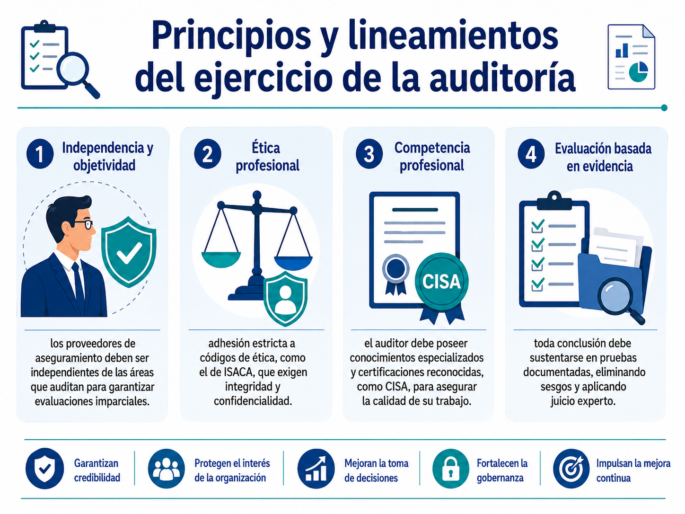
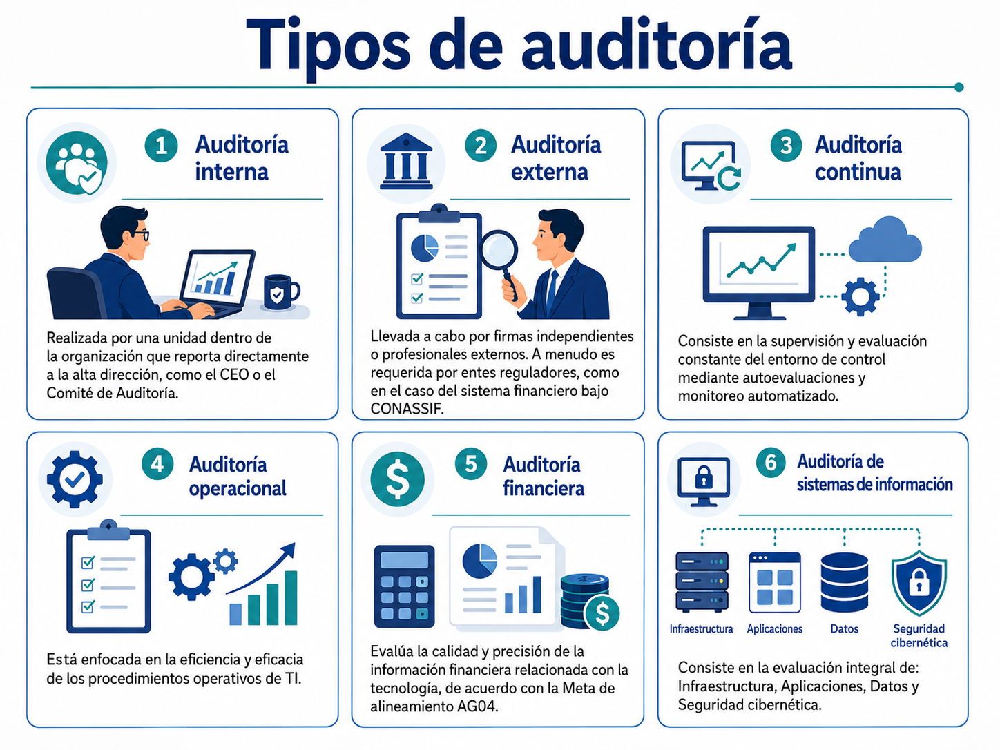
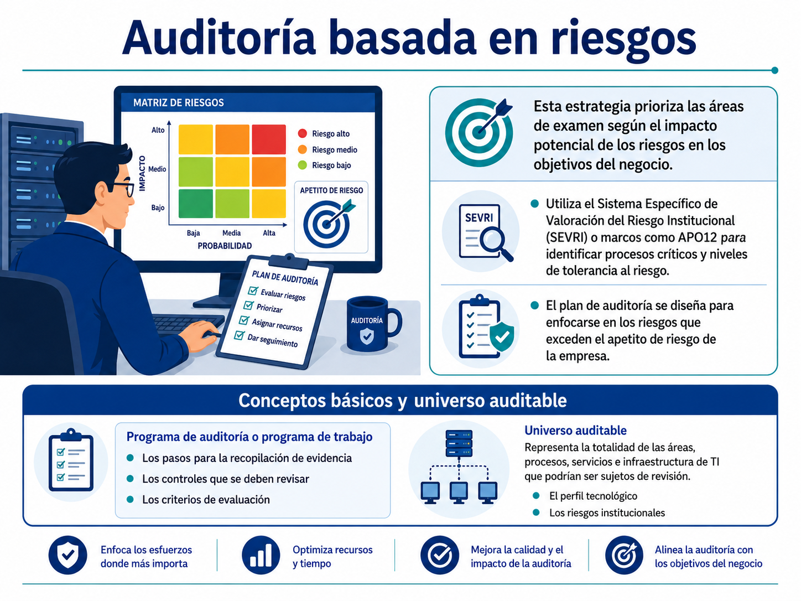

# Fundamentos de la Auditoría de Sistemas

## 1. ¿Qué es la auditoría de sistemas?

La auditoría de sistemas, o auditoría de TI, es una **función especializada** encargada de realizar revisiones y actividades de **aseguramiento independiente** sobre el marco de gobierno y gestión de las tecnologías de información.

Su propósito es evaluar si los controles de TI:

* Protegen los activos.
* Mantienen la integridad de los datos.
* Operan de forma eficaz para alcanzar los objetivos de la organización.

## 2. Objetivos de la auditoría de TI

Según el dominio **MEA (Monitorizar, Evaluar y Valorar)** de COBIT 2019, los objetivos principales son:

* **Proporcionar transparencia:** ofrecer información clara a las partes interesadas sobre la idoneidad del sistema de control interno.
* **Generar confianza:** brindar seguridad sobre el logro de los objetivos empresariales y la gestión adecuada del riesgo residual.
* **Evaluar el cumplimiento:** verificar que los procesos de TI cumplen con leyes, regulaciones y requisitos contractuales externos.
* **Validar la eficacia operativa:** probar si los controles establecidos son adecuados y suficientes para minimizar el impacto de incidentes.

## 3. Diferencia entre auditoría, consultoría y gestión

En el marco de gobierno y gestión, estas funciones tienen roles distintos:

### Gobierno: Evaluar, Dirigir y Monitorizar

Es responsabilidad del **Órgano de Dirección**. Se encarga de evaluar las necesidades de las partes interesadas y supervisar el cumplimiento de la estrategia.

### Gestión: Alinear, Construir y Ejecutar

Es responsabilidad de la **gerencia**. Se enfoca en planificar, construir y ejecutar las actividades de TI para lograr las metas de la empresa.

### Auditoría: Aseguramiento

Es una función **independiente** que evalúa tanto el gobierno como la gestión.

A diferencia de la consultoría, que puede proponer diseños, la auditoría debe mantener objetividad y no participar en la ejecución para no perder su independencia.

## 4. Principios y lineamientos del ejercicio de la auditoría

El auditor de TI debe regirse por los siguientes pilares:

* **Independencia y objetividad:** los proveedores de aseguramiento deben ser independientes de las áreas que auditan para garantizar evaluaciones imparciales.
* **Ética profesional:** adhesión estricta a códigos de ética, como el de ISACA, que exigen integridad y confidencialidad.
* **Competencia profesional:** el auditor debe poseer conocimientos especializados y certificaciones reconocidas, como **CISA**, para asegurar la calidad de su trabajo.
* **Evaluación basada en evidencia:** toda conclusión debe sustentarse en pruebas documentadas, eliminando sesgos y aplicando juicio experto.

## 5. Tipos de auditoría

### Auditoría interna

Realizada por una unidad dentro de la organización que reporta directamente a la alta dirección, como el CEO o el Comité de Auditoría.

### Auditoría externa

Llevada a cabo por firmas independientes o profesionales externos. A menudo es requerida por entes reguladores, como en el caso del sistema financiero bajo CONASSIF.

### Auditoría continua

Consiste en la supervisión y evaluación constante del entorno de control mediante autoevaluaciones y monitoreo automatizado.

### Auditoría operacional

Está enfocada en la eficiencia y eficacia de los procedimientos operativos de TI.

### Auditoría financiera

Evalúa la calidad y precisión de la información financiera relacionada con la tecnología, de acuerdo con la **Meta de alineamiento AG04**.

### Auditoría de sistemas de información

Consiste en la evaluación integral de:

* Infraestructura.
* Aplicaciones.
* Datos.
* Seguridad cibernética.

## 6. Auditoría de sistemas basada en riesgos

Este enfoque consiste en **priorizar las áreas de examen** según el impacto potencial de los riesgos en los objetivos del negocio.

* Utiliza el **Sistema Específico de Valoración del Riesgo Institucional (SEVRI)** o marcos como **APO12** para identificar procesos críticos y niveles de tolerancia al riesgo.
* El plan de auditoría se diseña para enfocarse en los riesgos que exceden el apetito de riesgo de la empresa.

## 7. Conceptos básicos y universo auditable

### Programa de auditoría o programa de trabajo

Es un documento detallado que estructura:

* Los pasos para la recopilación de evidencia.
* Los controles que se deben revisar.
* Los criterios de evaluación.

### Universo auditable

Representa la totalidad de las áreas, procesos, servicios e infraestructura de TI que podrían ser sujetos de revisión.

En Costa Rica, la Auditoría Interna debe definir este universo considerando:

* El perfil tecnológico.
* Los riesgos institucionales.
