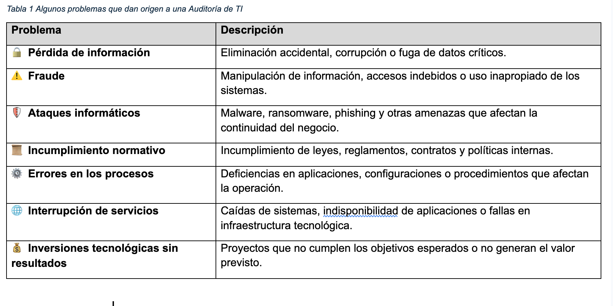
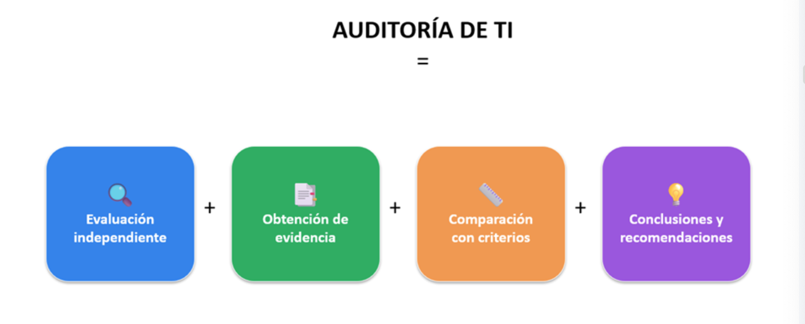
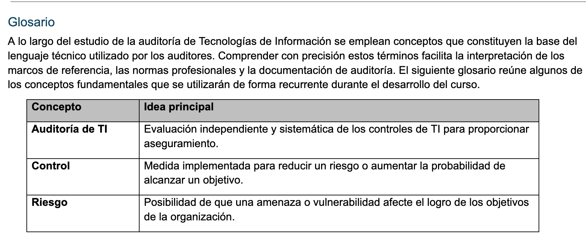
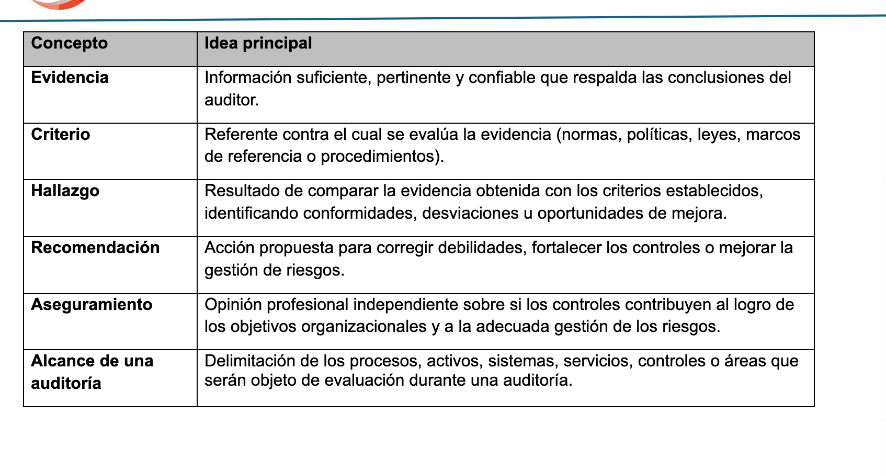
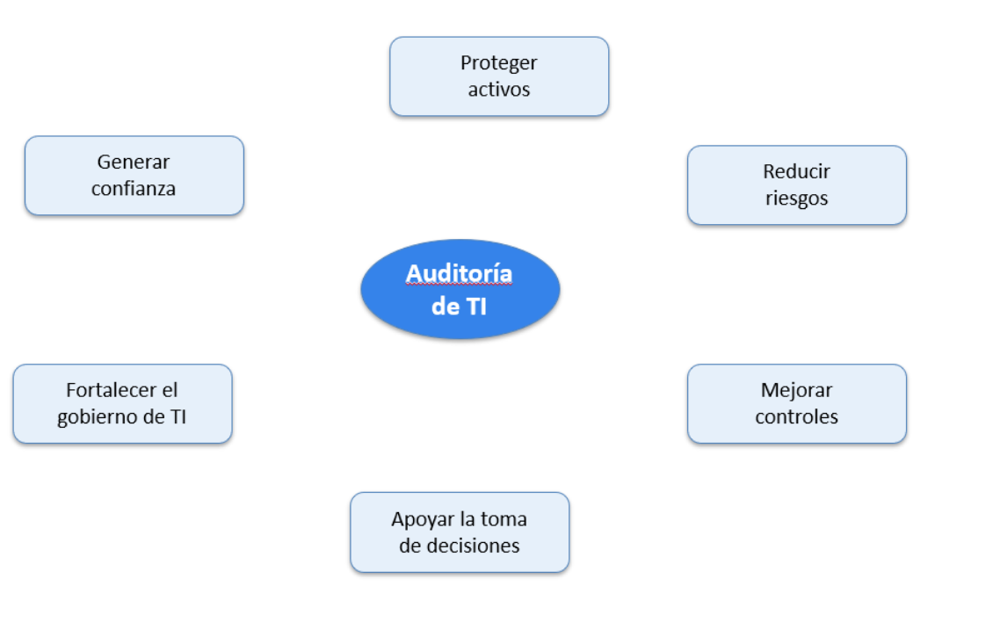
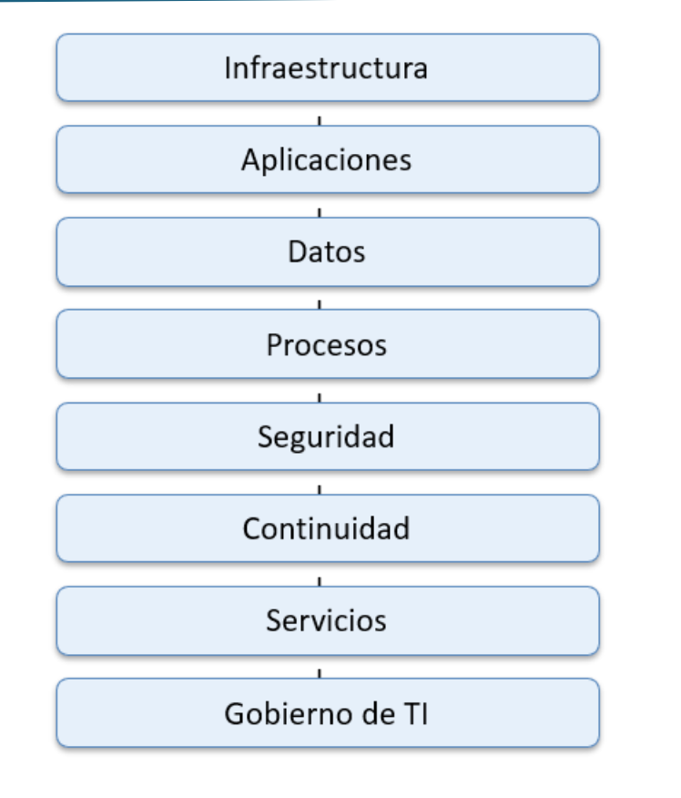
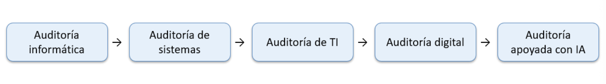
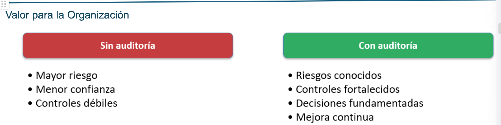
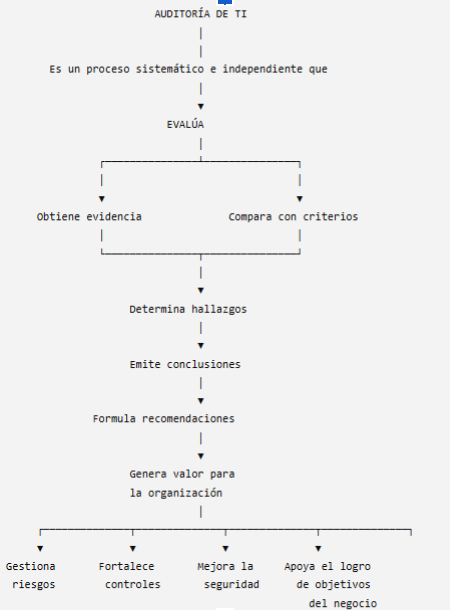

# Lección 01: Introducción a la Auditoría de Tecnologías de Información

> **Curso:** EIF543 Auditoría de Sistemas  
> **Material para clase**  
> Las imágenes se conservan en su formato original, sin rediseños ni modificaciones.

---

## 1. Contexto de la organización


*Ilustración 1. Empresa XYZ.*

---

## 2. Problemas que pueden dar origen a una auditoría de TI



*Tabla 1. Algunos problemas que dan origen a una Auditoría de TI.*

---

## 3. Concepto general de Auditoría de TI



La Auditoría de TI integra:

- evaluación independiente;
- obtención de evidencia;
- comparación con criterios;
- conclusiones y recomendaciones.

---

## 4. Glosario básico

### 4.1 Conceptos iniciales



### 4.2 Conceptos complementarios



---

## 5. Objetivos de la Auditoría de TI



---

## 6. Áreas que pueden ser objeto de auditoría



---

## 7. Evolución de la Auditoría de TI



---

## 8. Valor para la organización



---

## 9. Síntesis conceptual



---

## Estructura para GitHub

```text
Leccion_01_Auditoria_TI_GitHub/
├── Leccion_01_Auditoria_TI.md
└── imagenes/
    ├── 01_empresa_xyz.png
    ├── 02_problemas_origen_auditoria_ti.png
    ├── 03_definicion_auditoria_ti.png
    ├── 04_glosario_parte_1.png
    ├── 05_glosario_parte_2.png
    ├── 06_objetivos_auditoria_ti.png
    ├── 07_areas_auditables.png
    ├── 08_evolucion_auditoria_ti.png
    ├── 09_valor_para_organizacion.png
    └── 10_mapa_conceptual_auditoria_ti.png
```
